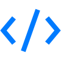
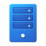
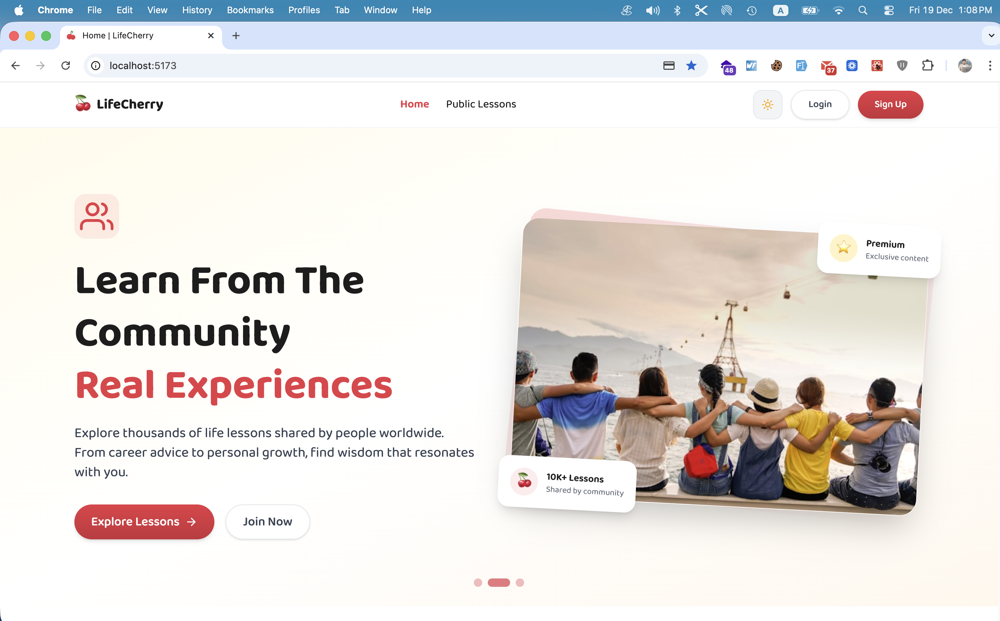

<!-- Animated Circuit Board Header -->

<!-- Dynamic Typing Effect -->

  

 
 

<!-- Status Badges & Social Links -->

 
  
  
  
  
  
  

 
 
 

<!-- About Me Section -->

  
   
  <strong>About Me & Expertise</strong>
   
  Transforming complex problems into elegant, scalable digital solutions
    

 

<table width="100%">
<tr>
<td width="60%" valign="center">

I’ve spent the last **12+ years** building software that solves real business problems.

To me, you aren't just a ticket number. I take the time to look beyond the technical specs and understand your vision, ensuring we build a solution that actually drives growth. Whether it's a complex SaaS platform or a custom automation tool, I deliver code that is **clean, secure, and reliable.**

 

**Honest advice, transparent work, and results you can build on.**

</td>
<td width="40%" align="center">
  
</td>
</tr>
</table>

 
 
 
<!-- Services Card View -->
<!-- Services Card View -->

  
   
  <strong>Premium Services & Solutions</strong>
   
  Delivering excellence through modern technologies and best practices
    

 

<!-- Row 1 -->
<table border="0">
<tr>
<td align="center" width="50%">

<table width="100%">
<tr>
<td align="center">

### Frontend Excellence

 

Building **lightning-fast**, accessible, and scalable user interfaces with Core Web Vitals focus.

 

</td>
</tr>
</table>

</td>
<td align="center" width="50%">

<table width="100%">
<tr>
<td align="center">

### Full-Stack Solutions

 

Robust full-stack apps with secure backend architectures and seamless **client-server integration**.

 

</td>
</tr>
</table>

</td>
</tr>
</table>

<!-- Row 2 -->
<table border="0">
<tr>
<td align="center" width="50%">

<table width="100%">
<tr>
<td align="center">

### SaaS Architecture

 

Production-ready SaaS platforms with **multi-tenancy**, role-based access, and cloud deployments.

 

</td>
</tr>
</table>

</td>
<td align="center" width="50%">

<table width="100%">
<tr>
<td align="center">

### API Development

 

Efficient REST and GraphQL APIs optimized for speed, security, and **scalability**.

 

</td>
</tr>
</table>

</td>
</tr>
</table>

<!-- Row 3 -->
<table border="0">
<tr>
<td align="center" width="50%">

<table width="100%">
<tr>
<td align="center">

### Real-time BaaS

 

Rapid development with serverless backends, **real-time sync**, and secure cloud functions.

 

</td>
</tr>
</table>

</td>
<td align="center" width="50%">

<table width="100%">
<tr>
<td align="center">

### WordPress Custom

 

Custom themes and plugins for speed, SEO, and **business growth** without bloated builders.

 

</td>
</tr>
</table>

</td>
</tr>
</table>

<!-- Row 4 -->
<table border="0">
<tr>
<td align="center" width="50%">

<table width="100%">
<tr>
<td align="center">

### Laravel Ecosystem

 

Building robust apps with **Inertia.js**, Livewire, and scalable APIs using modern frontend stacks.

 

</td>
</tr>
</table>

</td>
<td align="center" width="50%">

<table width="100%">
<tr>
<td align="center">

### Performance & SEO

 

Optimizing **Core Web Vitals**, rankings, and conversion rates for peak performance.

 

</td>
</tr>
</table>

</td>
</tr>
</table>

 
 
 

<!-- Tech Stack Section -->
<!-- Tech Stack Section -->

  
   
  <strong>Tech Stack</strong>
   
  The modern technologies I use to build scalable solutions
    

<table border="1" width="100%" cellpadding="20">
    <tr>
        <td align="center"> JavaScript</td>
        <td align="center"> TypeScript</td>
        <td align="center"> React</td>
        <td align="center"> Next.js</td>
        <td align="center"> Node.js</td>
        <td align="center"> Express</td>
        <td align="center"> Tailwind</td>
    </tr>
    <tr>
        <td align="center"> HTML5</td>
        <td align="center"> CSS3</td>
        <td align="center"> PHP</td>
        <td align="center"> Laravel</td>
        <td align="center"> WordPress</td>
        <td align="center"> Shopify</td>
        <td align="center"> MySQL</td>
    </tr>
    <tr>
        <td align="center"> MongoDB</td>
        <td align="center"> PostgreSQL</td>
        <td align="center"> Firebase</td>
        <td align="center"> Supabase</td>
        <td align="center"> Prisma</td>
        <td align="center"> Docker</td>
        <td align="center"> AWS</td>
    </tr>
    <tr>
        <td align="center"> DigitalOcean</td>
        <td align="center"> Vercel</td>
        <td align="center"> Netlify</td>
        <td align="center"> Git</td>
        <td align="center"> GitHub</td>
        <td align="center"> Figma</td>
        <td align="center"> Linux</td>
    </tr>
</table>

 
 
 
<!-- Featured Projects -->
<!-- Featured Projects -->

  
   
  <strong>Featured Projects</strong>
   
  Recent work showcasing my technical capabilities
    

<table border="0" width="100%">
  <tr>
    <td width="55%" align="center">
      
    </td>
    <td width="45%" valign="top">
      <h3 align="left">LifeCherry Frontend</h3>
      

        <b>The Challenge:</b> Build an intuitive frontend for a social health platform that makes wellness tracking feel natural and engaging.
      

      

        <b>The Solution:</b> Designed and developed a React-based interface focused on smooth user flows, clear data visualization, and responsive design.
      

      

        <b>Tech Stack:</b> 
        
        
        
      

      <a href="https://github.com/iamOmarFaruk/LifeCherry-frontend">💻 View Source Code</a>
    </td>
  </tr>
  <tr>
    <td width="55%" align="center">
      
    </td>
    <td width="45%" valign="top">
      <h3 align="left">EcoTrack Dashboard</h3>
      

        <b>The Challenge:</b> Create a comprehensive dashboard for environmental data tracking with clear reporting.
      

      

        <b>The Solution:</b> Built a React dashboard with clean UI components that transform complex environmental data into actionable insights.
      

      

        <b>Tech Stack:</b> 
        
        
        
      

      <a href="https://github.com/iamOmarFaruk/EcoTrack-Front">💻 View Source Code</a>
    </td>
  </tr>
</table>

 
 
 
<!-- Testimonials -->
<!-- Testimonials -->

  
   
  <strong>What Clients Say</strong>
   
  Feedback from satisfied clients around the globe
    

<table border="0" width="100%">
  <tr>
    <td width="33%" align="center" valign="top">
      
        
      "Very good service. He problem solved really well and gave us a better solution than we had hoped for! I will definitely use again."
        
      <b>— Alex Steffan</b>
    </td>
    <td width="33%" align="center" valign="top">
      
        
      "Omar is a great React, Next.js, and Express (MERN) expert and can build stunning websites. We're always impressed with the quality."
        
      <b>— Corinne Fisher</b>
    </td>
    <td width="33%" align="center" valign="top">
      
        
      "Omar did a remarkable job on my site and communicated well. My regular developer might not have been able to do as good a job as him."
        
      <b>— Udam Epa</b>
    </td>
  </tr>
</table>

 
 
 

  Clean code is written by someone who cares — Omar

