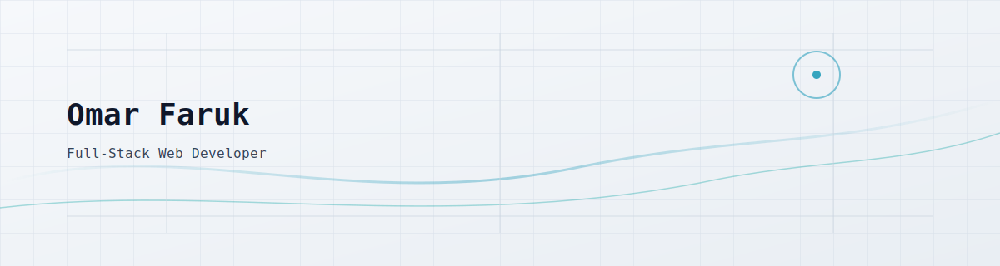

<picture>
  <source media="(prefers-color-scheme: dark)" srcset="./assets/banner-dark.svg">
  <source media="(prefers-color-scheme: light)" srcset="./assets/banner-light.svg">
  
</picture>

<div align="center">
  <h1>Omar Faruk</h1>
  <p><strong>Full-Stack Developer &bull; CMS Expert &bull; Performance & DevOps Specialist</strong></p>
  <p>Building scalable, high-performance web solutions that drive real business results</p>
</div>

<div align="center">
  <a href="https://www.google.com/maps/place/Bangladesh">
    
  </a>
  <a href="https://www.upwork.com/freelancers/~0139a09420769b0b8c">
    
  </a>
  <a href="https://omarfaruk.dev/">
    
  </a>
  <a href="mailto:omabg.bd@gmail.com">
    
  </a>
</div>


## 📊 Quick Stats

<div align="center">

| 💼 Projects Completed | ⭐ Client Rating | 🌍 Global Clients | ⚡ Response Time |
|:---:|:---:|:---:|:---:|
| **50+** | **5.0/5.0** | **15+ Countries** | **24 Hours** |

</div>


## 👋 About Me

I'm a full-stack developer who turns complex business challenges into elegant, performant web solutions. With 5+ years of experience building everything from e-commerce platforms to SaaS applications, I focus on delivering code that's not just functional, but maintainable, scalable, and optimized for growth.

**What drives my work:**
- **Client-First Mindset**: I don't just build features—I solve business problems. Every line of code serves your goals.
- **Quality Over Speed**: Clean, documented, tested code that your team can maintain and scale confidently.
- **Communication That Works**: Regular updates, clear timelines, and honest feedback throughout the entire process.

I work with startups, agencies, and businesses worldwide, helping them ship products faster without compromising quality.

<table>
  <tr>
    <td width="60%">
      <h3>🎯 My Approach</h3>
      <ul>
        <li>Based in Bangladesh, collaborating with clients across US, Europe, and Asia Pacific</li>
        <li>Specialized in React/Next.js ecosystems with full-stack capabilities</li>
        <li>Strong focus on performance optimization and clean architecture</li>
        <li>Experienced in both greenfield projects and legacy code modernization</li>
      </ul>
    </td>
    <td align="center" width="40%">
      
    </td>
  </tr>
</table>


## 💎 What Makes Me Different

<table>
<tr>
<td width="50%">

### ⚡ Fast Turnaround
Average 24-hour response time with flexible availability across multiple time zones. I respect your timeline and communicate proactively about any blockers.

</td>
<td width="50%">

### 🧹 Clean Code Culture
Every project includes comprehensive documentation, meaningful tests, and code that follows industry best practices. Your future developers will thank you.

</td>
</tr>
<tr>
<td width="50%">

### 📈 Business-First Approach
I think beyond the code. Whether it's optimizing for conversions, improving load times, or planning for scale—I focus on outcomes that matter to your business.

</td>
<td width="50%">

### 🛡️ Post-Launch Support
Every project includes 30 days of support for bug fixes and adjustments. I stand behind my work and ensure smooth handoff to your team.

</td>
</tr>
</table>


## 🛠️ Tech Stack & Expertise

I believe in using the right tool for the job. Here's my toolkit organized by use case:

### 🚀 SaaS & Web Application Stack
Building modern, scalable applications with best-in-class performance.


### 🛒 E-commerce & CMS Stack
Delivering conversion-optimized online stores and content platforms.


### ⚙️ Backend & Database Stack
Robust APIs and efficient data architecture.


### 🚀 DevOps & Deployment Stack
Fast, reliable deployments with monitoring and CI/CD.


### 🎯 Additional Tools & Libraries
Quality assurance and developer experience optimization.


## 🚀 Featured Projects

### 📱 LifeCherry Frontend


**The Challenge:** Build an intuitive frontend for a social health platform that makes wellness tracking feel natural and engaging.

**The Solution:** Designed and developed a React-based interface focused on smooth user flows, clear data visualization, and responsive design that works seamlessly across devices.

**The Impact:**
- Clean, user-friendly interface that reduced onboarding time by focusing on simplicity
- Smooth integration with REST API backend
- Responsive design optimized for mobile-first wellness tracking

**Tech Stack:**


[💻 View Source Code](https://github.com/iamOmarFaruk/LifeCherry-frontend)

---

### 📊 EcoTrack Dashboard


**The Challenge:** Create a comprehensive dashboard for environmental data tracking with clear reporting and intuitive data visualization.

**The Solution:** Built a React dashboard with clean UI components that transform complex environmental data into actionable insights through charts, tables, and custom visualizations.

**The Impact:**
- Dashboard-style interface that makes data interpretation effortless
- Real-time data updates with optimized rendering
- Export functionality for custom reporting needs

**Tech Stack:**


[💻 View Source Code](https://github.com/iamOmarFaruk/EcoTrack-Front)

---

> 📝 **Note:** Project screenshots coming soon. These are live production projects with real users.


## 💼 Professional Services

I offer comprehensive web development services tailored to your specific needs. All services include code documentation, knowledge transfer, and 30-day post-launch support.

### 🎨 Custom Web Application Development

Build modern, scalable web applications from the ground up.

**What You Get:**
- ✅ Custom React/Next.js architecture designed for your specific needs
- ✅ Responsive design that works flawlessly across all devices and browsers
- ✅ Performance optimization targeting 90+ Lighthouse scores
- ✅ SEO-ready implementation with proper meta tags and structured data
- ✅ Comprehensive documentation and code comments
- ✅ 30-day post-launch support for bug fixes and adjustments

**Ideal For:** Startups, SaaS products, business dashboards, internal tools
**Typical Timeline:** 2-6 weeks depending on scope and complexity

---

### 🛒 E-commerce & CMS Solutions

Launch or optimize your online store or content platform.

**What You Get:**
- ✅ Custom Shopify theme development or WordPress solutions
- ✅ WooCommerce setup with payment gateway integration
- ✅ Conversion-focused design and UX optimization
- ✅ Product catalog management and inventory systems
- ✅ Mobile-optimized checkout flows
- ✅ Analytics integration and performance tracking

**Ideal For:** Online retailers, content publishers, digital product sellers
**Typical Timeline:** 2-4 weeks depending on customization needs

---

### ⚙️ API Development & Backend Services

Build robust, scalable backend systems and integrations.

**What You Get:**
- ✅ RESTful API development with Node.js/Express or Laravel
- ✅ Database design and optimization (SQL and NoSQL)
- ✅ Third-party API integrations (Stripe, Twilio, SendGrid, etc.)
- ✅ Authentication systems (JWT, OAuth, SSO)
- ✅ Rate limiting, caching, and security best practices
- ✅ Comprehensive API documentation

**Ideal For:** Applications needing backend services, API-first architectures
**Typical Timeline:** 2-4 weeks depending on complexity

---

### 🚀 Deployment, DevOps & Performance

Optimize deployment pipelines and application performance.

**What You Get:**
- ✅ CI/CD pipeline setup with GitHub Actions
- ✅ Docker containerization and deployment automation
- ✅ Cloud deployment (Vercel, AWS, Digital Ocean)
- ✅ Performance audits and optimization
- ✅ Monitoring and error tracking setup
- ✅ Load testing and scaling strategies

**Ideal For:** Teams needing deployment automation or performance improvements
**Typical Timeline:** 1-2 weeks for initial setup

---

### 🔧 Maintenance & Ongoing Support

Keep your application running smoothly with regular maintenance.

**What You Get:**
- ✅ Performance audits and optimization
- ✅ Bug fixes and security updates
- ✅ Feature enhancements and improvements
- ✅ Dependency updates and compatibility checks
- ✅ Technical consultation and planning
- ✅ Monthly retainer options available

**Ideal For:** Existing applications needing ongoing technical support
**Pricing:** Hourly or monthly retainer based on needs


## 🔄 How I Work

My development process is designed for transparency, quality, and timely delivery.

```
1️⃣  Discovery & Planning (Days 1-2)
    └─ Understand requirements, define scope, align on goals
    └─ Create detailed proposal with timeline and milestones

2️⃣  Design & Architecture (Days 3-5)
    └─ Wireframes and mockups for approval
    └─ Technical architecture and tech stack selection
    └─ Database schema and API planning

3️⃣  Development Sprints (Weeks 2-4)
    └─ Agile development with regular check-ins
    └─ Weekly demos of progress
    └─ Continuous integration and code reviews

4️⃣  Testing & QA (Week 4-5)
    └─ Automated tests and manual QA
    └─ Cross-browser and device testing
    └─ Performance audits and optimization

5️⃣  Deployment (Final Week)
    └─ Production deployment with CI/CD setup
    └─ Monitoring and analytics integration
    └─ Complete documentation and handoff

6️⃣  Post-Launch Support (30 Days)
    └─ Bug fixes and adjustments
    └─ Performance monitoring
    └─ Team training and knowledge transfer
```


## 🎖️ By the Numbers

<div align="center">

<table>
<tr>
<td align="center" width="25%">
<h3>5+</h3>
<p><strong>Years Experience</strong></p>
<p>Full-stack development</p>
</td>
<td align="center" width="25%">
<h3>50+</h3>
<p><strong>Projects Completed</strong></p>
<p>Delivered on time</p>
</td>
<td align="center" width="25%">
<h3>5.0/5.0</h3>
<p><strong>Client Rating</strong></p>
<p>Average across platforms</p>
</td>
<td align="center" width="25%">
<h3>24h</h3>
<p><strong>Response Time</strong></p>
<p>Average reply speed</p>
</td>
</tr>
</table>

</div>


## 💬 What Clients Say

<table>
<tr>
<td width="33%">

> "Very good service. He problem solved really well and gave us a better solution than we had hoped for! I will definitely use again."
>
> **— Alex Steffan**
> *Upwork Client*
> ⭐⭐⭐⭐⭐

</td>
<td width="33%">

> "Omar is a great React, Next.js, and Express (MERN) expert and can build stunning websites. We're always impressed with the quality of his work."
>
> **— Corinne Fisher**
> *CEO, Purely Digital Marketing*
> ⭐⭐⭐⭐⭐

</td>
<td width="33%">

> "Omar did a remarkable job on my site and communicated well throughout the entirety of the project. My regular developer might not have been able to do as good a job as him."
>
> **— Udam Epa**
> *Upwork Client*
> ⭐⭐⭐⭐⭐

</td>
</tr>
</table>

### 🎥 Video Testimonial

Hear directly from a satisfied client about their experience working with me:

[](https://youtu.be/aGL9-PHO29M)


## 📈 GitHub Activity

<div align="center">
  <picture>
    <source media="(prefers-color-scheme: dark)" srcset="https://github-readme-stats.vercel.app/api?username=iamOmarFaruk&show_icons=true&hide_rank=true&bg_color=0b0f14&title_color=22d3ee&text_color=cbd5e1&icon_color=22d3ee&border_color=1f2937">
    
  </picture>
  <picture>
    <source media="(prefers-color-scheme: dark)" srcset="https://streak-stats.demolab.com?user=iamOmarFaruk&background=0b0f14&border=1f2937&ring=22d3ee&fire=22d3ee&currStreakNum=e2e8f0&sideNums=e2e8f0&currStreakLabel=94a3b8&sideLabels=94a3b8&dates=64748b">
    
  </picture>
</div>


## ❓ Frequently Asked Questions

**Q: Are you available for new projects?**
A: Yes! I'm currently accepting projects. [Contact me](mailto:omabg.bd@gmail.com) to discuss your needs and timeline.

**Q: What's your typical response time?**
A: I respond to all inquiries within 24 hours, usually much faster. During active projects, I provide daily updates.

**Q: Do you work with existing teams?**
A: Absolutely! I integrate seamlessly with existing development teams or work independently based on your needs.

**Q: What time zones do you support?**
A: I maintain flexible hours and can overlap with US (EST/PST), Europe (GMT/CET), and Asia Pacific time zones.

**Q: What's included in post-launch support?**
A: All projects include 30 days of bug fixes, minor adjustments, performance monitoring, and technical support.

**Q: Do you sign NDAs and contracts?**
A: Yes, I'm happy to sign NDAs, work-for-hire agreements, and any other required legal documents.

**Q: Can I hire you for ongoing monthly work?**
A: Yes! I offer monthly retainers for ongoing development, maintenance, and technical consultation. Let's discuss your needs.

**Q: What if I need changes after the project is completed?**
A: Minor adjustments are included in the 30-day support period. For larger changes or new features, we can discuss hourly rates or a new project scope.


## 🤝 Let's Build Something Great Together

Ready to bring your project to life? I'd love to hear about your goals and discuss how I can help.

<div align="center">

### 📧 Get In Touch

<a href="mailto:omabg.bd@gmail.com">
  
</a>
<a href="https://www.upwork.com/freelancers/~0139a09420769b0b8c">
  
</a>
<a href="https://omarfaruk.dev/">
  
</a>

---

### 🔗 Connect on Social

<a href="https://www.linkedin.com/in/omar-expert-webdeveloper/">
  
</a>
<a href="https://github.com/iamOmarFaruk">
  
</a>
<a href="https://x.com/omarfaruksarkar">
  
</a>
<a href="https://www.facebook.com/omar00faruk">
  
</a>

</div>


<div align="center">

> "Clean code is not written by following a set of rules. Clean code is written by someone who cares."

<sub>Last updated: 2026-01-01</sub>

</div>
